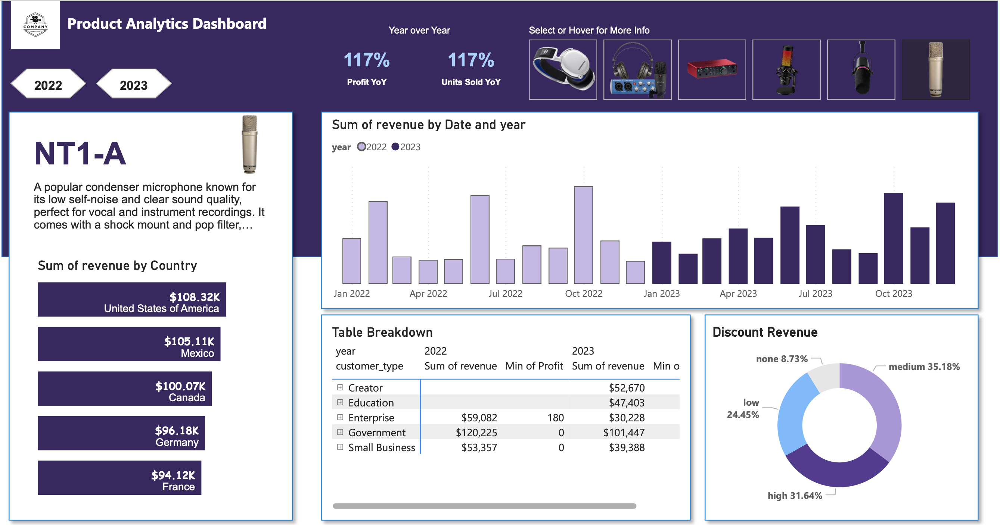

# Product Analytics Dashboard

### 📌 Overview

This Product Analytics Dashboard provides key insights into product performance, revenue trends, and sales metrics. The dashboard was built using Power BI for visualization and MySQL Workbench for data extraction and transformation. It enables data-driven decision-making by analyzing revenue distribution, profit margins, and customer segmentation.

### 🛠 Tools Used
- Power BI – Data visualization and interactive reporting
- MySQL Workbench – Querying and data extraction
- SQL – Data transformation and analysis
- DAX (Power BI) – Custom calculations and measures

### 📑 Project Requirements
This dashboard was developed based on a request to track key product performance indicators. The main objectives were:

- ✅ Revenue by Country – Identify top-performing regions
- ✅ Revenue Trends by Year & Date – Compare revenue performance over time
- ✅ Profit & Units Sold YoY Change – Analyze year-over-year growth
- ✅ Revenue Breakdown by Discount Band – Understand the impact of discounts
- ✅ Detailed Table View – Revenue and profit breakdown by customer type

### 📊 Key Insights
- **Top Revenue-Generating Countries:** 🇺🇸 USA ($108.32K), 🇲🇽 Mexico ($105.11K), 🇨🇦 Canada ($100.07K)
- **YoY Growth:** **107%** increase in Profit and **108%** increase in Units Sold
- **Revenue by Discount Band:** 
  - **Medium Discounts** contributed **35.18%** of revenue
  - **High Discounts** contributed **31.64%**
- **Customer Segmentation:**
  - The **Government** sector accounted for **42.25%** of total revenue with a profit margin of **$401,324**
  - Other major contributors: Enterprise, Education
